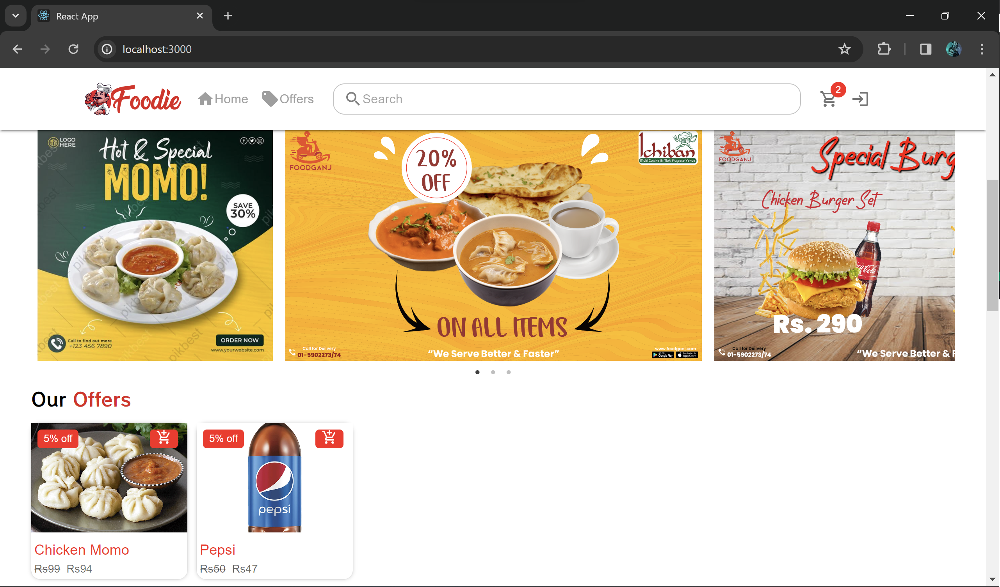
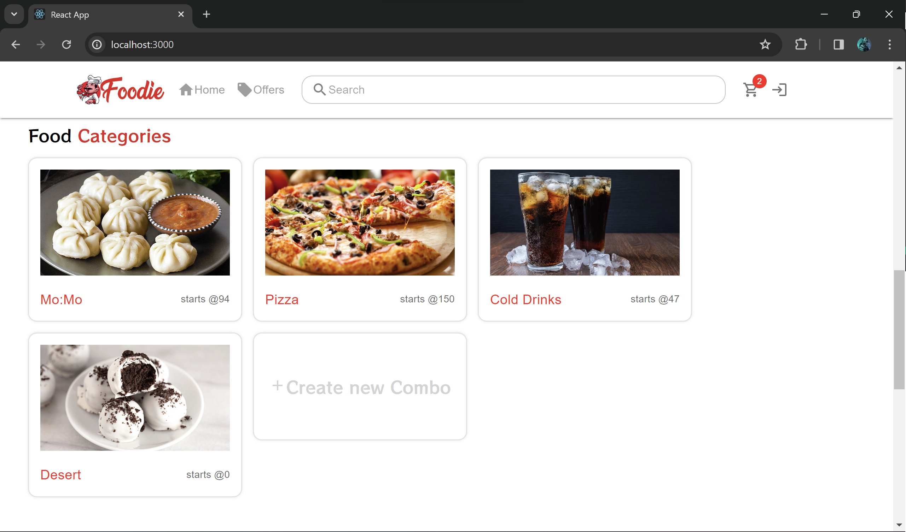
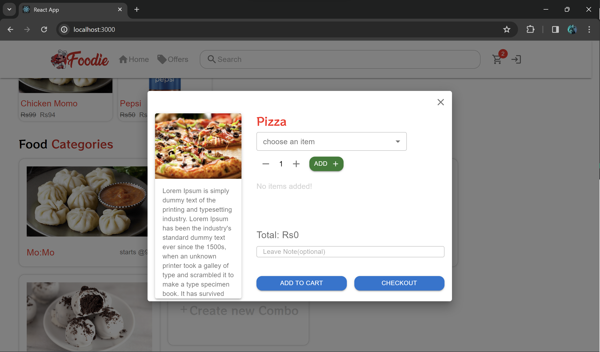
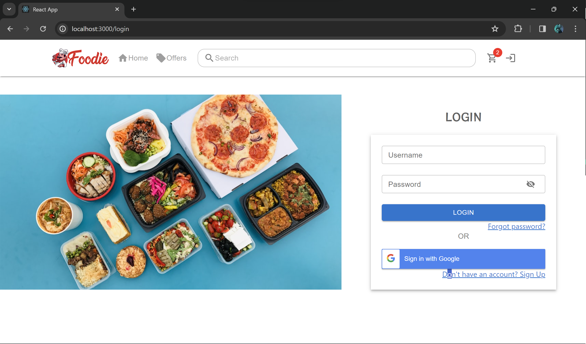
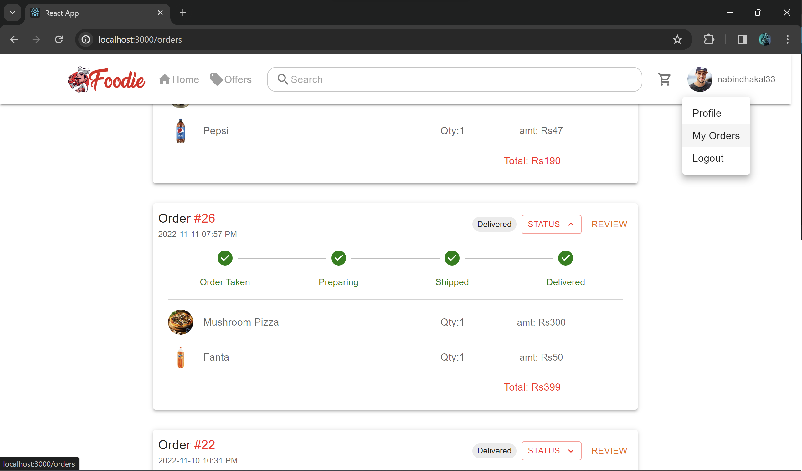
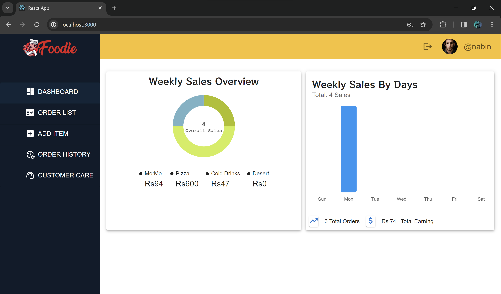
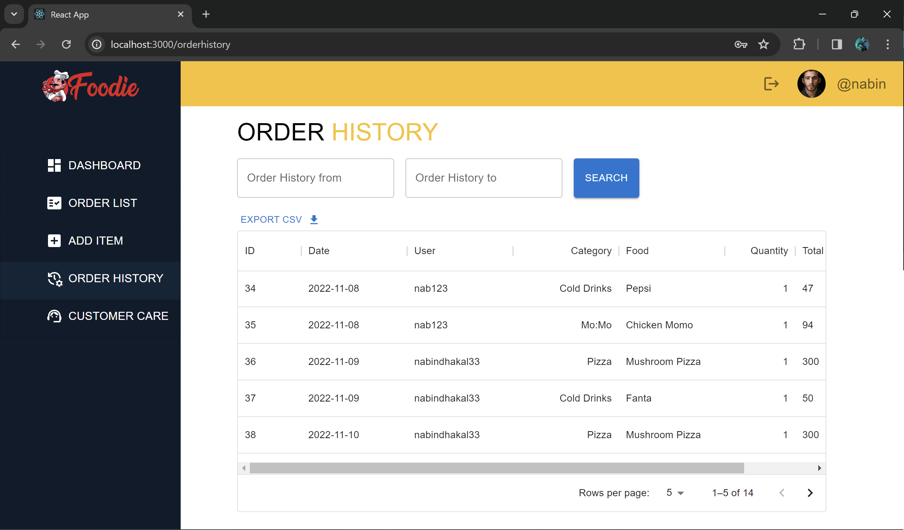
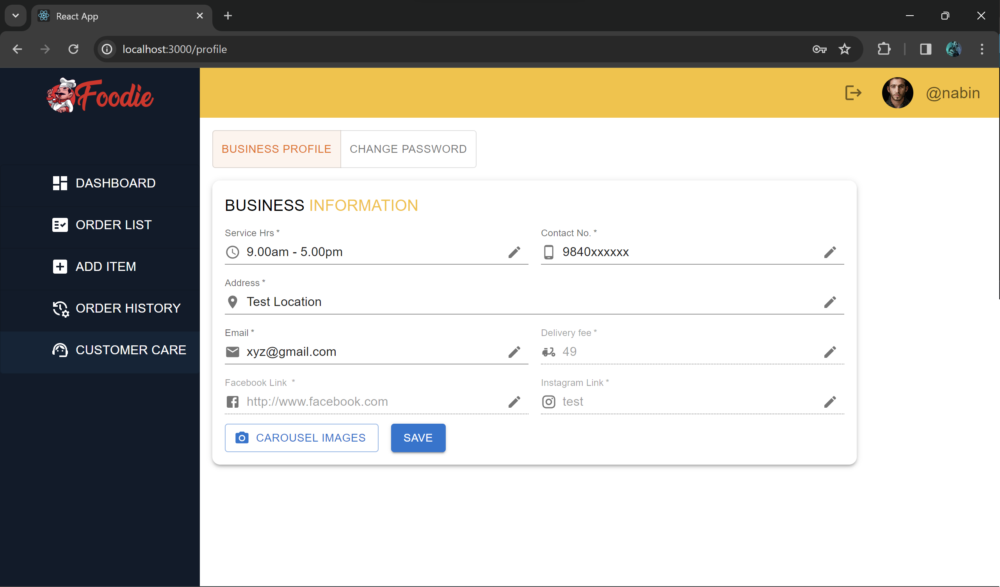

## Installation:
- clone the project
- ```pip install -r backend/requirements.txt```
- ```cd frontend``` ``` npm install --force```
- Open two terminals for backend and frontend
- ```python manage.py runserver``` ```npm start
- Both the customer and owner can login from the same page. If the username has ```IsStaff``` permission then the user is considered a owner. Superusers are by default owners.
- Don't forget to assign these in ```core/settings.py```
 ```EMAIL_HOST_USER = '<your-business-gmail>' EMAIL_HOST_PASSWORD='<token-gained-for-third-party-app-for-gmail>' ```

## OAuth2.0 Setup:
- go to Django admin-page and under DJANGO OAUTH TOOLKIT create new Applications and copy the ```Client id``` and  ```Client secret``` before saving
- optain ```Google Client Id``` 
- create a ```.env``` file inside frontend folder add the ids in format below:		```
```
#django oauth backend credentials
REACT_APP_CLIENT_ID = <>
REACT_APP_CLIENT_SECRET = <>
#provided by google
REACT_APP_GOOGLE_CLIENT_ID = <>
```

## Customer Side Images











## Owner Site Images







